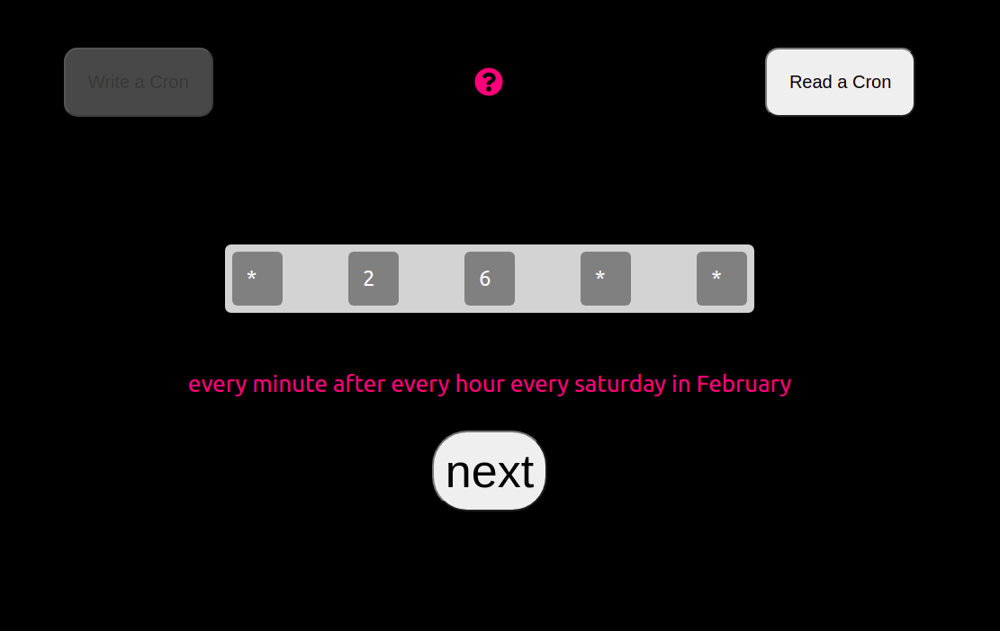
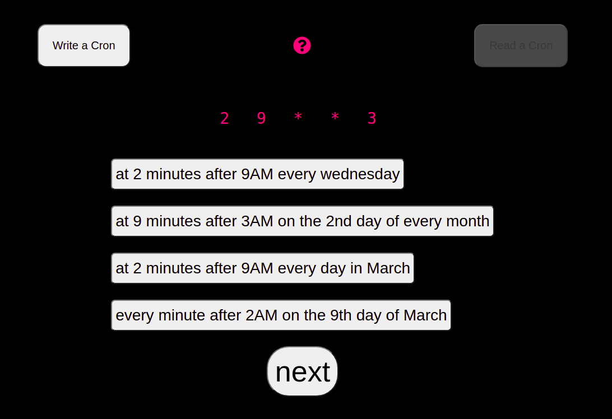

# Cron Trigger


Writing a cron


Reading a cron

This is a micromaterial to practice both reading and writing cron expressions

We _miiiiiight_ at some point also expand to use AWS style syntax (with the zany "?" stuff everywhere), but the simple MVP is just regular ole crons.

## Example for reading a cron:

```
15 14 1 * *
```

The user needs to show that they can interpret this cron by selecting the correct schedule (in words).

## Example for writing a cron:

"at 3AM every Wednesday"

The user has the building blocks (`3 * 3 * 0`), but just out of order, and they need to be re-arranged. These are autogenerated algorithmically.

## Running locally

This will be react, naturally, and so a simple:

```
npm i && npm start
```

should have you up and running in no time!
