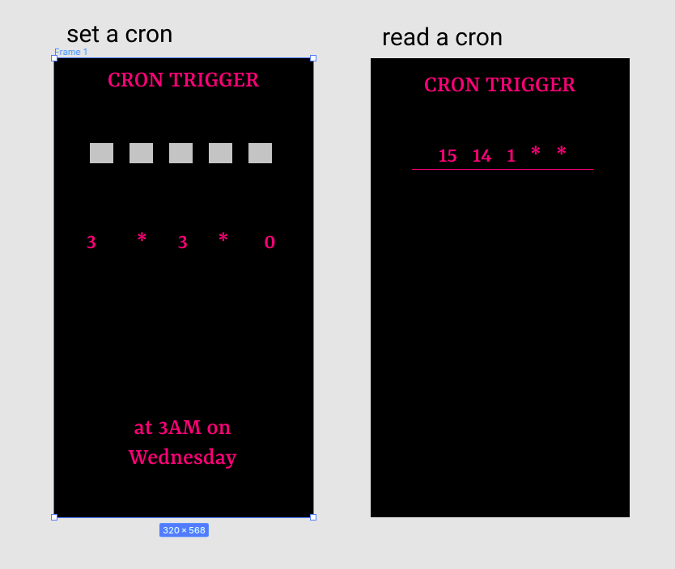

# Cron Trigger



This is a micromaterial to practice both reading and writing cron expressions

We _miiiiiight_ at some point also expand to use AWS style syntax (with the zany "?" stuff everywhere), but the simple MVP is just regular ole crons.

## Example for reading a cron:

```
15 14 1 * *
```

The user needs to "somehow" (to be determined) show that they can interpret this cron...maybe to start with we'll just have multiple choice. In theory, these should be "generate-able", but could be easier to just hardcode at the start.

## Example for writing a cron:

"at 3AM every Wednesday"

The user has the building blocks (`3 * 3 * 0`), but just out of order, and they need to be re-arranged. Again, for a simple MVP, probably just hardcode 20 or so of these, and then eventually attempt to auto-generate them.

## Running locally

This will be react, naturally, and so a simple:

```
npm i && npm start
```

should have you up and running in no time!
